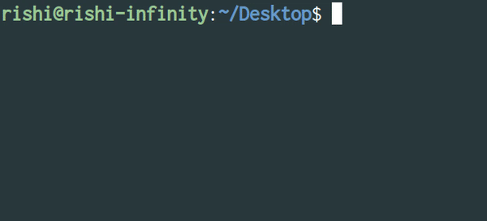

# github-init

Command Line tool to create repo on github.



### Prerequisites

Need Node.js to be installed on computer.

Install [dns](https://github.com/hbouvier/dns) npm package on your computer.

```
sudo npm install -g dns
```

### Installing

Clone the repo

Open terminal

```
cd github-int
```

Now install all the required packages by

```
yarn install 
```

or

```
npm install
```

Now you will need to get the Personal access token from Github account to get that you need to go to this [page](https://help.github.com/articles/creating-a-personal-access-token-for-the-command-line/).

After generating the access token copy and paste it to the token.js file.

Install it globally to your machine by running 

```
sudo npm -g install
``` 

type `github` to run the tool.

## License

This project is licensed under the MIT License - see the [LICENSE](LICENSE) file for details.